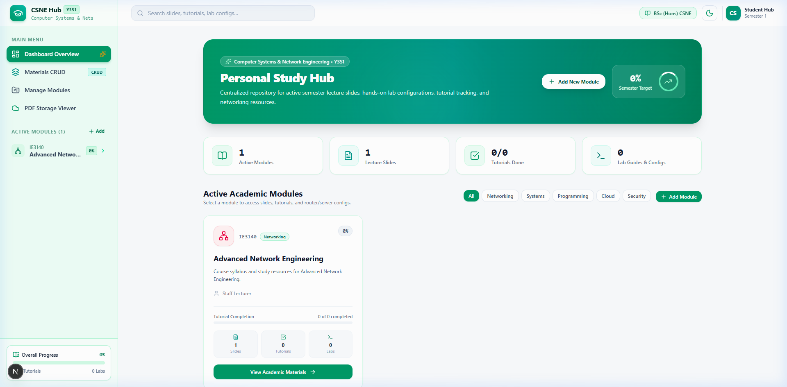
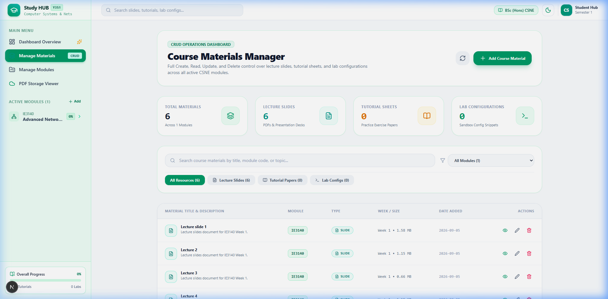
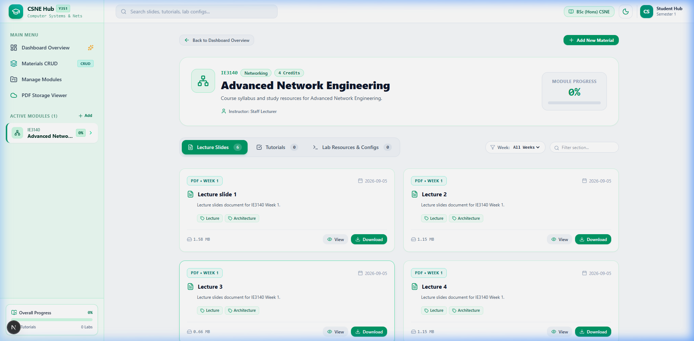
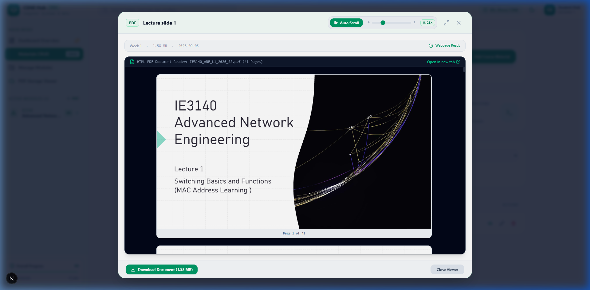

# 🎓 Study HUB — Academic Materials & Lab Tracking

> A modern, responsive, full-featured academic dashboard for tracking course materials, lecture slides, tutorial sheets, and lab configurations with embedded PDF reading and auto-scroll tools.

---

## 🌟 Key Features

- 🌿 **Light Green & White Academic Theme**: Modern aesthetic featuring emerald & teal accents, clean slate typography, and full dark mode support.
- 📂 **Manage Materials (CRUD)**: Complete Create, Read, Update, and Delete operations for managing course content across modules.
- 📄 **Advanced PDF Viewer with Auto-Scroll**:
  - Embedded slide viewer modal with full-screen expansion mode.
  - Custom speed range slider (0x to 1x) for hands-free lecture slide reading.
- ☁️ **Cloud Storage Integration**: Integrated UploadThing cloud file dropzone for slide decks, PDF documents, and network lab scripts.
- 📊 **Module Progress & Analytics**: Real-time completion progress tracking, credit breakdown, and difficulty badge categorization.
- 🎨 **Responsive Sidebar & Navigation**: Collapsible drawer navigation tailored for both desktop and mobile viewports.

---

## 📸 Application Screenshots

### 1. 🏠 Dashboard Overview
*Centralized hub displaying active modules, progress metrics, and upcoming tutorial tasks.*



---

### 2. 🗂️ Manage Materials Page (CRUD)
*Comprehensive table for searching, filtering, creating, editing, and deleting course materials.*



---

### 3. 📘 Module Details Page
*Dedicated view for lecture slides, tutorial sheets, and lab configuration snippets for individual modules.*



---

### 4. 📄 Interactive PDF Viewer with Auto-Scroll Slider
*Hands-free slide reading modal with adjustable auto-scroll speed controls.*



---

## 🛠️ Technology Stack

- **Framework**: [Next.js 14](https://nextjs.org/) (App Router)
- **Language**: [TypeScript](https://www.typescriptlang.org/)
- **Styling**: [Tailwind CSS](https://tailwindcss.com/)
- **Icons**: [Lucide React](https://lucide.dev/)
- **Cloud Storage**: [UploadThing](https://uploadthing.com/)
- **PDF Rendering**: [@react-pdf-viewer/core](https://react-pdf-viewer.dev/) / HTML Canvas & iFrame Embeds
- **State Management**: React Context API (`StudyHubContext`)

---

## 🚀 Getting Started

### Prerequisites

Ensure you have **Node.js 18.x** or higher and **npm** installed.

### Installation

1. **Clone the repository**:
   ```bash
   git clone https://github.com/Ginura1256/Study-Hub.git
   cd Study-Hub
   ```

2. **Install dependencies**:
   ```bash
   npm install
   ```

3. **Set up Environment Variables**:
   Create a `.env.local` file in the root directory:
   ```env
   UPLOADTHING_TOKEN=your_uploadthing_token_here
   ```

4. **Run the Development Server**:
   ```bash
   npm run dev
   ```

5. **Open in Browser**:
   Navigate to [http://localhost:3000](http://localhost:3000) in your web browser.

---

## 📁 Directory Structure

```text
Study-Hub/
├── public/
│   └── screenshots/       # Screenshots for README documentation
├── src/
│   ├── app/
│   │   ├── api/          # Next.js API Routes (UploadThing handler)
│   │   ├── manage/       # Manage Modules page
│   │   ├── materials/    # Manage Materials CRUD page
│   │   ├── modules/[id]/ # Dynamic Module Details route
│   │   ├── resources/    # PDF Storage Viewer page
│   │   ├── layout.tsx    # Root layout & providers
│   │   └── page.tsx      # Main Dashboard Overview page
│   ├── components/       # UI components (Header, Sidebar, Modals, Cards)
│   ├── context/          # React Context (StudyHubContext for state persistence)
│   ├── data/             # Mock dataset for modules and resources
│   └── lib/              # UploadThing helper utilities
├── .env.example
├── next.config.mjs
├── tailwind.config.ts
└── tsconfig.json
```

---

## 📜 License

Distributed under the MIT License. See `LICENSE` for more information.
